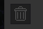

# Minetest-Mod: trashbin

## What is this?

This is a small mod for minetest, which adds a trashbin to the inventory to leave the waste.

## How to install?

Locate the mods-folder of your minetest(-server)-installation.

Click the *clone or download*-button in GitHub-Repository and download the ZIP-file to the mods-folder by clicking *Download ZIP* or if you have git installed call the following in your mods-folder:
	
	git clone https://github.com/mflink3012/trashbin.git

Now you can select this mod in you minetest-client for singleplayer (e.g. for testing). If you want to use it on your minetest-server you have to edit the world's corresponding ``world.mt`` (inside the specific world-folder) and add

	load_mod_trashbin = true

to its end.

## Which dependencies?

See shipped [depends.txt](depends.txt).

## How to use?

1. Open the inventory.
2. Place whatever you want to remove from the inventory onto the tashbin-icon.
3. Tada! The waste is gone forever!

 

## Known issues?

See the ``issues``-tab in GitHub-Repository.

## Tested with?

minetest 0.4.15

## What license?

GPL 3.0 (See the [LICENSE](LICENSE)-file shipped or <https://www.gnu.org/licenses/gpl-3.0.txt> for details.)
